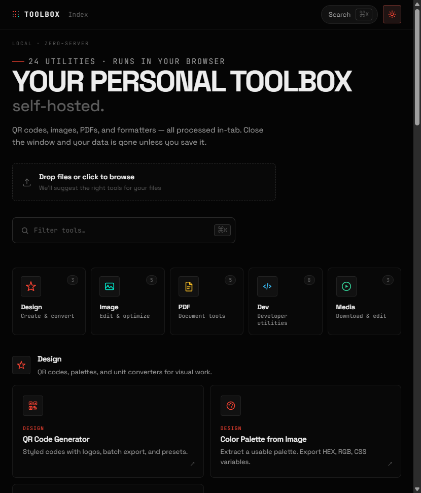
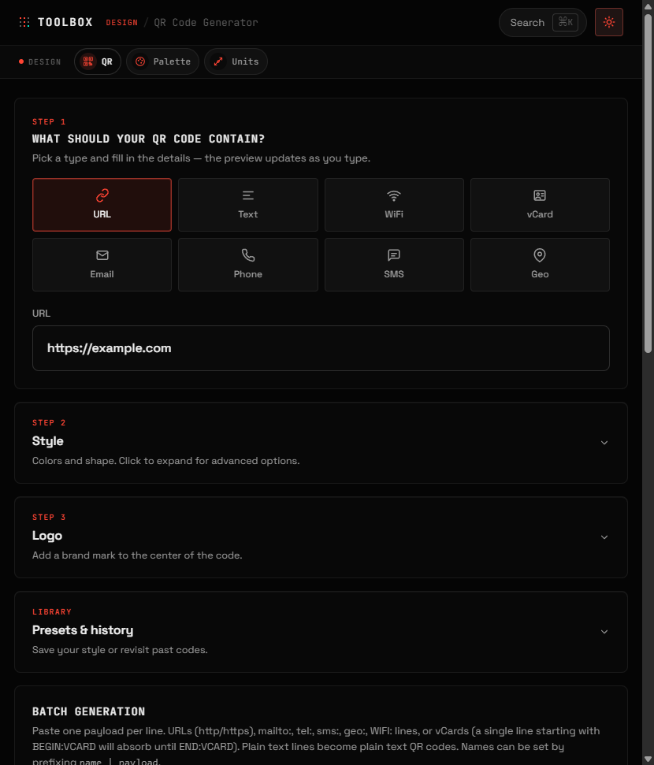
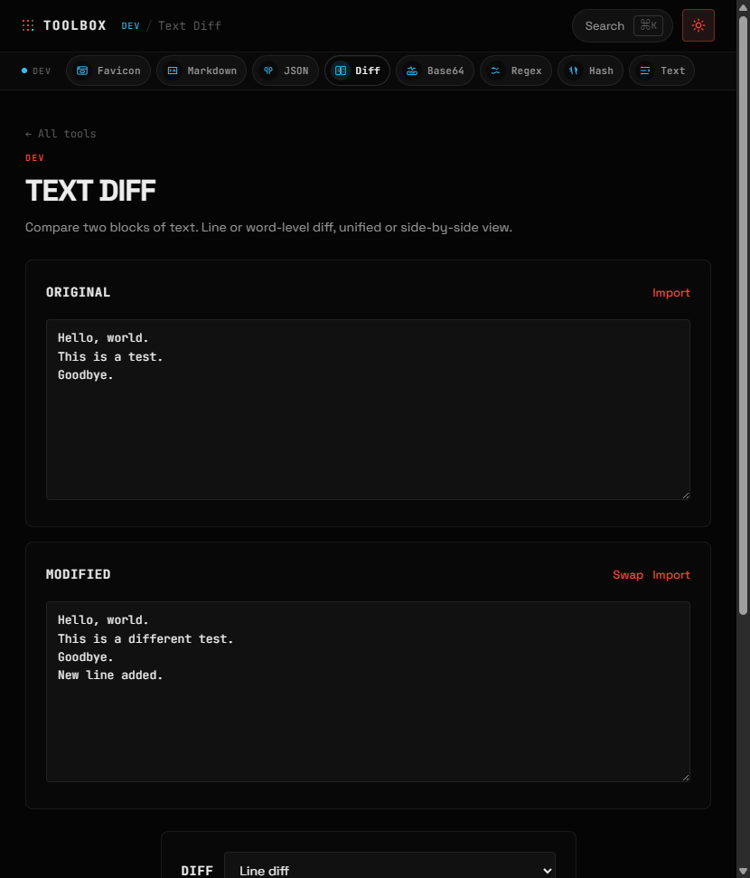
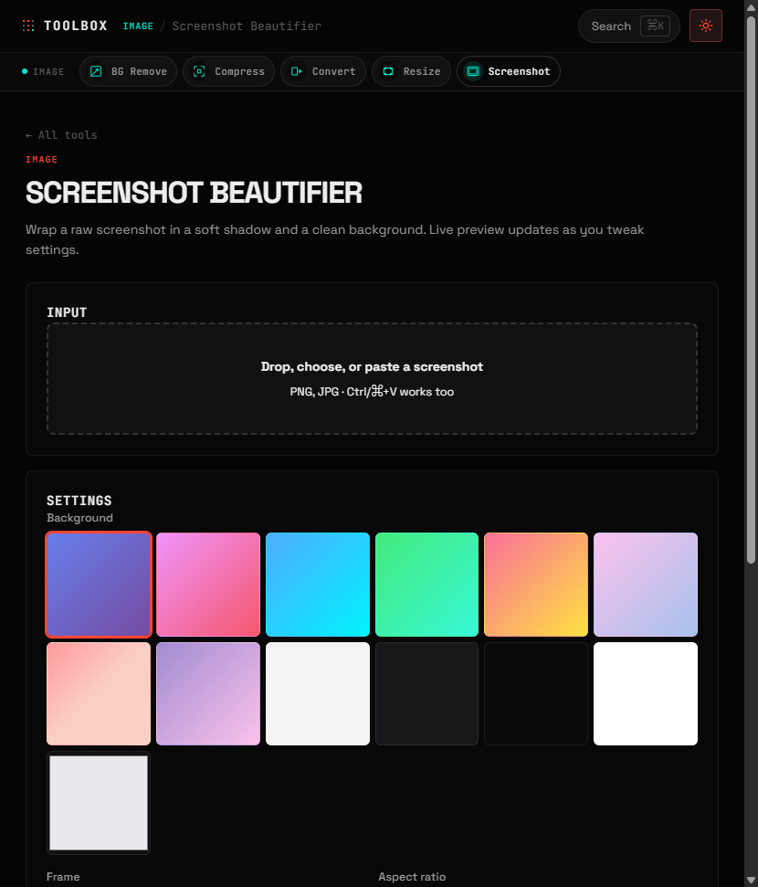
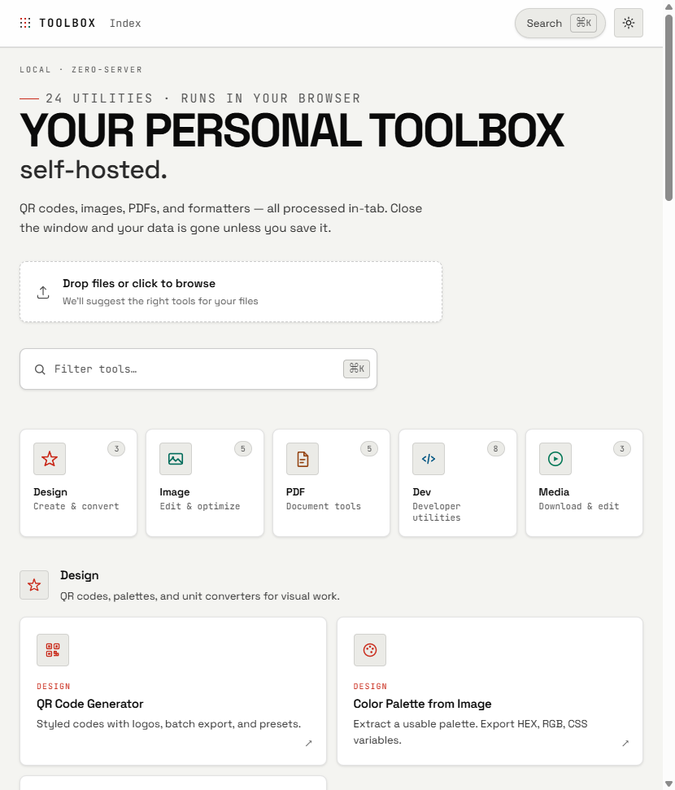

<div align="center">


# Selfbox

### Your personal toolbox — image, PDF, dev, and media utilities that run in the browser on **your** machine.

*QR codes, images, PDFs, and formatters — all processed in-tab. Close the window and your data is gone unless you save it.*

<br />



<br />


<br />

**[Quick Start](#-quick-start) · [Features](#-what-you-get) · [Preview](#-see-it-in-action) · [All Tools](#-all-tools) · [Deploy](#-run-in-production) · [Privacy](#-privacy)**

</div>

---

## Why Selfbox

Most utility sites want your files on their servers. Selfbox is the opposite: a **self-hosted web app** packed with everyday tools — compress a photo, merge a PDF, generate a QR code, diff two texts, export Markdown, or annotate an image. Most work happens **entirely in the browser**. No accounts, no tracking, no backend required for the core tools.

> Drop a file on the home screen and Selfbox suggests the right tool. Press `Ctrl+K` / `Cmd+K` to jump anywhere instantly.

Built with React, TypeScript, and Vite. Hash routing (`/#/qr`) means any static host works — no rewrite rules required.

---

## See it in action

Real screenshots from the running app — dark theme, live UI.

| Home | QR Code Generator | Text Diff |
|:---:|:---:|:---:|
| [](docs/assets/hero-home.png) | [](docs/assets/qr-generator.png) | [](docs/assets/text-diff.png) |
| 24 tools · smart file routing | Styled codes, logos, batch export | Line/word diff · patch export |

| Screenshot Beautifier |
|:---:|
| [](docs/assets/screenshot-beautifier.png) |
| Frames, shadows, gradient backgrounds · live preview |

### Dark & light themes

Same app, two themes — toggle in the header or follow system preference.

| Dark | Light |
|:---:|:---:|
|  |  |

<p align="center">
  
</p>

---

## What you get

| | |
|---|---|
| **25+ tools** | Design, image, PDF, dev, and media workflows in one place |
| **Local-first** | Processing stays in your browser tab for most tools |
| **Self-hosted** | Deploy the built `dist/` folder on any static host |
| **Hash routing** | URLs like `/#/qr` — no special server rewrite rules required |
| **Themes** | Dark, light, or follow system preference |
| **Command palette** | Press `Ctrl+K` / `Cmd+K` to jump to any tool |

### Highlights

- **Design** — QR codes with logos & batch export, color palettes from images, unit & color converters
- **Image** — background removal, compression, HEIC conversion, resize/crop, screenshot beautifier
- **PDF** — merge, split, rotate, OCR, optimize, images-to-PDF
- **Dev** — JSON/CSV, text diff, Base64, regex, hashes, Markdown → PDF/PNG, favicons
- **Media** — GIF tools, image editor, optional media downloader (server-side)

### How it works

1. **Clone & build** — standard Node.js project (`npm install` → `npm run dev` or `npm run build`).
2. **Open in browser** — pick a tool from the home screen or command palette.
3. **Work locally** — drop files, edit, export. Data stays on the client unless you download a result.
4. **Deploy** — ship the `dist/` folder to nginx, Apache, Docker, or any static host.

The only exception is **Media Downloader**, which needs a small Node API and external CLI tools (`yt-dlp`, `ffmpeg`, `spotdl`) on the server host.

---

## Quick start

### Prerequisites

- **Node.js** 20+ (22 LTS recommended)
- **npm** 10+
- A modern browser (Chrome, Firefox, Safari, or Edge — latest stable)

### 1. Clone the repo

```bash
git clone https://github.com/R3ktline/selfbox.git
cd selfbox
```

### 2. Install dependencies

```bash
npm install
```

### 3. Start the dev server

```bash
npm run dev
```

Open the URL Vite prints (usually **http://localhost:5173**). The app hot-reloads as you edit code.

### 4. Other commands

```bash
npm run build    # Type-check + production build → dist/
npm run preview  # Serve dist/ locally (http://localhost:4173)
npm run lint     # Run oxlint
```

---

## Run in production

After `npm run build`, upload everything inside **`dist/`** to your web server. That is the entire app for all browser-only tools.

### Option A — nginx

```nginx
server {
    listen 80;
    server_name toolbox.example.com;
    root /var/www/selfbox;
    index index.html;

    location / {
        try_files $uri $uri/ /index.html;
    }

    location /assets/ {
        expires 30d;
        add_header Cache-Control "public, immutable";
    }
}
```

Add HTTPS with [Certbot](https://certbot.eff.org/) or your host's TLS panel.

### Option B — Docker

```dockerfile
FROM node:22-alpine AS build
WORKDIR /app
COPY package*.json ./
RUN npm ci
COPY . .
RUN npm run build

FROM nginx:alpine
COPY --from=build /app/dist /usr/share/nginx/html
EXPOSE 80
```

```bash
docker build -t selfbox .
docker run -d -p 8080:80 --name selfbox selfbox
```

Visit **http://localhost:8080**.

### Option C — Static hosts

Works on **GitHub Pages**, **Cloudflare Pages**, **Netlify**, **Vercel**, or any static file host.

| Setting | Value |
|---|---|
| Build command | `npm run build` |
| Output directory | `dist` |
| Node version | 20 or 22 |

No environment variables are needed for the static tools.

---

## All tools

### Design

| Tool | Route | What it does |
|---|---|---|
| QR Code Generator | `/#/qr` | Styled QR codes, logos, batch export, saved presets |
| Color Palette | `/#/image/palette` | Extract colors from an image → HEX, RGB, CSS variables |
| Unit & Color Converter | `/#/units` | px/rem/vw, color spaces, WCAG contrast checker |

### Image

| Tool | Route | What it does |
|---|---|---|
| Background Remover | `/#/image/background-remover` | Remove solid backgrounds → transparent PNG |
| Image Compressor | `/#/image/compressor` | Shrink to a target file size |
| Format Converter | `/#/image/convert` | HEIC/HEIF → PNG, JPEG, WebP |
| Resize & Crop | `/#/image/resize` | Resize and crop with live preview |
| Screenshot Beautifier | `/#/screenshot` | Device frames, shadows, aspect-ratio mockups |

### PDF

| Tool | Route | What it does |
|---|---|---|
| Page Editor | `/#/pdf/pages` | Merge, reorder, rotate, delete pages |
| Split & Export | `/#/pdf/split-export` | Split pages or export as images (ZIP) |
| Images to PDF | `/#/pdf/from-images` | Combine images into one PDF |
| Text Extract | `/#/pdf/ocr` | Copy text from PDFs; OCR for scans |
| Optimize | `/#/pdf/optimize` | Compress heavy PDFs, add watermark |

### Dev

| Tool | Route | What it does |
|---|---|---|
| Markdown Export | `/#/markdown` | GFM → styled PDF or PNG |
| JSON / CSV Formatter | `/#/json` | Pretty-print, tree view, CSV conversion |
| Text Diff | `/#/diff` | Line/word diff, side-by-side, patch export |
| Base64 | `/#/base64` | Encode/decode text, hex, images, files |
| Regex Tester | `/#/regex` | Live match highlighting + replace preview |
| Hash & UUID | `/#/hash` | SHA-256/512, UUID v4, nanoid |
| Text Tools | `/#/text` | Word count, find/replace, case/slug, spell check |
| Favicon Generator | `/#/favicon` | Multi-size PNGs, ICO, web manifest |

### Media

| Tool | Route | What it does |
|---|---|---|
| Media Downloader | `/#/media` | YouTube, X, SoundCloud, Spotify *(server required)* |
| GIF Tools | `/#/media/gif` | Split frames, preview, build GIF from images |
| Image Editor | `/#/media/edit` | Crop, blackout sensitive areas, add text labels |

---

## Media downloader setup

The Media Downloader is the **only tool that needs server-side helpers**. A plain static `dist/` deploy will not run it — use the Vite preview server or host the Node middleware yourself.

```bash
npm run build
npm run preview -- --host 0.0.0.0 --port 4173
```

Install these on the **host machine** and ensure they are on `PATH`:

| Dependency | Used for | Install |
|---|---|---|
| [yt-dlp](https://github.com/yt-dlp/yt-dlp) | YouTube, X/Twitter, SoundCloud | `pip install yt-dlp` |
| [FFmpeg](https://ffmpeg.org/) | Audio/video muxing | `apt install ffmpeg` / `brew install ffmpeg` |
| [spotDL](https://github.com/spotDL/spotify-downloader) | Spotify | `pip install spotdl` |
| Deno *(optional)* | Some yt-dlp extractors | [deno.land](https://deno.land/) |

The app checks which tools are available when you first open Media Downloader.

> Only download content you have the right to access. Respect platform terms and local law.

---

## Compatibility

### Server

| Requirement | Version |
|---|---|
| Node.js | 20+ (22 LTS recommended) |
| npm | 10+ |
| RAM (build) | ~1 GB free |
| Disk | ~500 MB for `node_modules` |

### Browser

| Browser | Minimum |
|---|---|
| Chrome / Edge | 120+ |
| Firefox | 120+ |
| Safari | 17+ |

**Browser features used:** Canvas 2D, Web Crypto, File/Blob APIs, `localStorage`, Web Workers (compression, OCR).

**Notes:**
- First load of HEIC, PDF, or OCR libraries downloads larger chunks (~1–2 MB) — cached afterward.
- Large PDFs (100+ pages) or huge images may hit memory limits on mobile.
- Spell check uses an English dictionary bundled in `public/dict/`.

---

## Privacy

- No analytics or tracking built in
- No file uploads to external servers for core tools
- Theme and QR presets stored in `localStorage` only
- Spell-check dictionaries served from your own host (`public/dict/`)
- Media Downloader runs `yt-dlp` / `spotDL` on **your** server, not a third party

---

## Project layout

```
selfbox/
├── docs/assets/         # README screenshots & banner
├── public/              # Favicons, spell-check dictionaries (en.aff / en.dic)
├── server/              # Media download API (Vite dev/preview middleware)
│   ├── media-api.ts
│   ├── ytdlp.ts
│   └── spotdl.ts
├── src/
│   ├── components/      # Shared UI (dropzone, color picker, command palette…)
│   ├── lib/             # Router, tool registry, helpers
│   └── pages/           # One page per tool
├── dist/                # Production output (created by npm run build)
├── index.html
├── package.json
└── vite.config.ts
```

---

## Tech stack

| Layer | Libraries |
|---|---|
| UI | React 19, TypeScript, Vite 8 |
| PDF | pdf-lib, pdf.js, Tesseract.js (OCR) |
| Images | browser-image-compression, heic2any, html2canvas |
| QR | qr-code-styling |
| Markdown | marked, highlight.js, jsPDF |
| Other | diff, jszip, typo-js, gifenc, gifuct-js |

---

## Contributing

Issues and pull requests welcome at [github.com/R3ktline/selfbox](https://github.com/R3ktline/selfbox).

---

## License

Provided as-is for personal and self-hosted use. Add a `LICENSE` file if you redistribute a fork.
